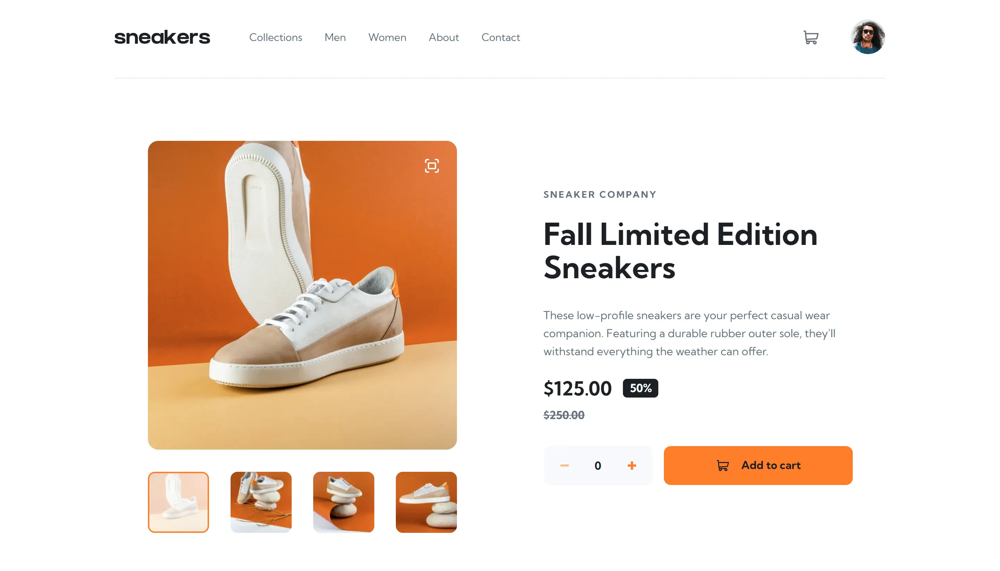
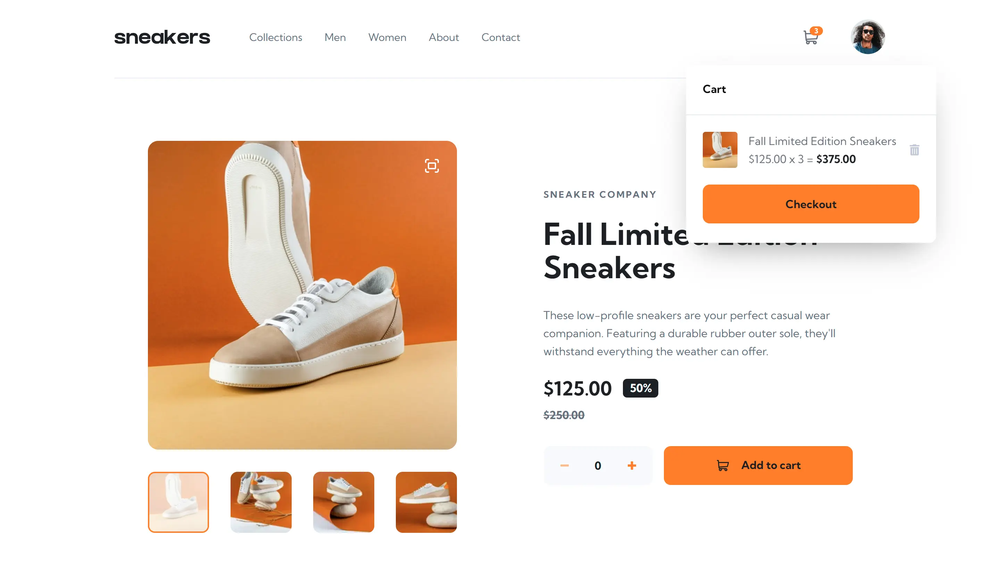
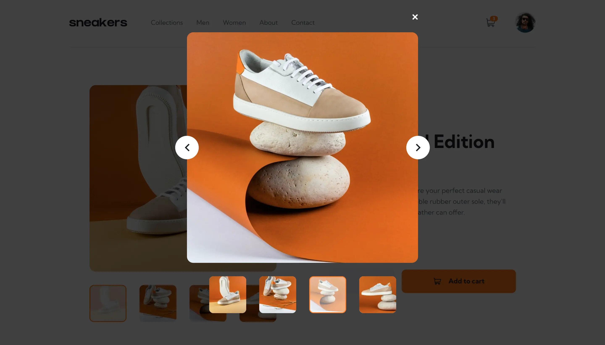

# Frontend Mentor - E-commerce product page solution

This is a solution to the [E-commerce product page challenge on Frontend Mentor](https://www.frontendmentor.io/challenges/ecommerce-product-page-UPsZ9MJp6). Frontend Mentor challenges help you improve your coding skills by building realistic projects.

- Live Site URL: [https://kerem-gurbuz-fm-ecommerce-product-page.vercel.app](https://kerem-gurbuz-fm-ecommerce-product-page.vercel.app)

## Table of contents

- [Overview](#overview)
- [Built with](#built-with)
- [Author](#author)

## Overview

### The challenge

Users should be able to:

- View the optimal layout for the site depending on their device's screen size
- See hover states for all interactive elements on the page
- Open a lightbox gallery by clicking on the large product image
- Switch the large product image by clicking on the small thumbnail images
- Add items to the cart
- View the cart and remove items from it

### Screenshots

## Built with

- [Next.js | TypeScript](https://nextjs.org/) - React framework
- [Redux Toolkit](https://redux-toolkit.js.org/) - Global state management
- [React Hook Form](https://react-hook-form.com/) - Form handling and validation
- [Zod](https://zod.dev/) - TypeScript-first schema declaration and validation
- [useHooks.ts](https://usehooks-ts.com/) - React hook library written in Typescript
- [Tailwind CSS](https://tailwindcss.com/) - Utility-first CSS framework
- [shadcn/ui](https://ui.shadcn.com/) - Accessible, customizable UI components
- Mobile-first workflow

## Author

- LinkedIn - [Kerem Gurbuz](https://www.linkedin.com/in/gurbuz-kerem)
- Frontend Mentor - [@kerem-gurbuz](https://www.frontendmentor.io/profile/kerem-gurbuz)
